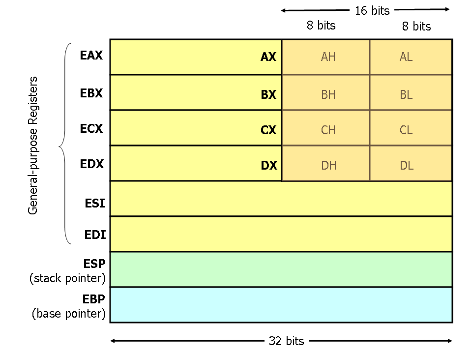
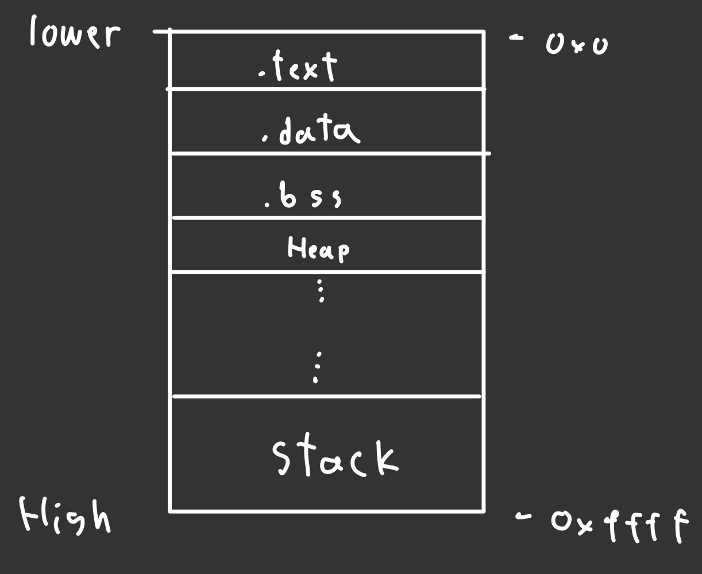
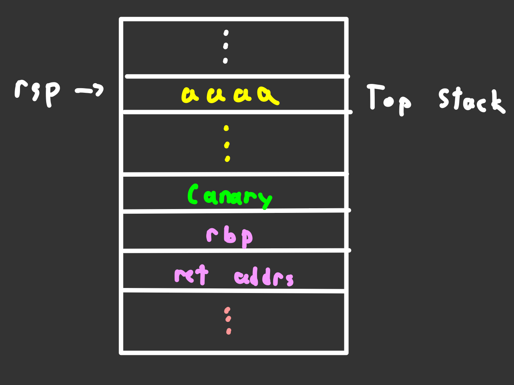
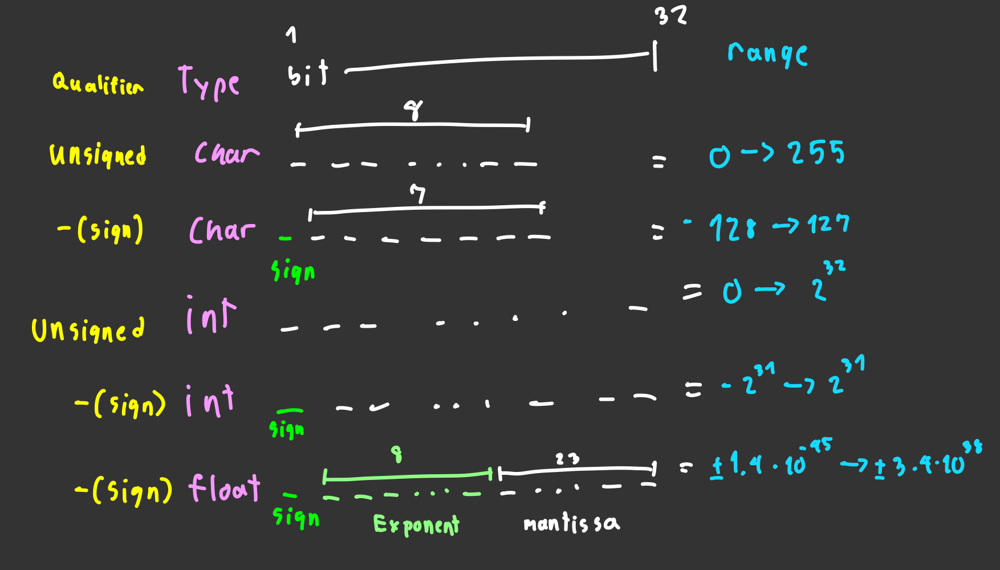
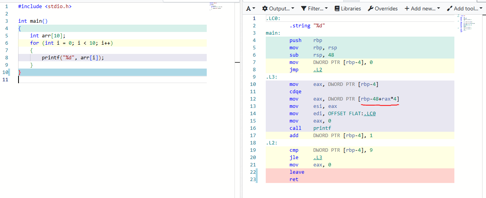

-Session & Topic
* Self Introduction (1min)
* Explanation Session
	* How does computer work (30 minute)
		 1 Architecture, CPU,ASM (20)
		  1.1 Architecture (1 minute)
	
			- สามารถแบ่งออกได้เป็น 2 ตัวหลักๆที่ใช้กันอยู๋ปัจจุบันโดยที่
			แบ่งแยกตามขนาดของ Registers ที่ใช้เก็บข้อมูลชั่วคราวบน CPU
			 4 byte -> x86, 8 byte -> x64
			 
		 1.2 CPU (5 minute )

			 - ทำงานด้วยการ 
			   Fetch ค่าจาก Memory ที่ Instruction Pointer (IP) และ 
			   Decode เป็น ประเภทของคำสั่ง และ Argument เพื่อระบุการทำงาน หลังจากนั้นก็จะ 
			   Execute เพื่อทำงานคำสั่ง
			   
			- CPU fetch ข้อมูล byte code จาก Memory 
			  Byte code ก็คือ Machine code 
			  เป็นชุดคำสั่งที่ CPU เข้าใจและทำงานได้ ซึ่งอยู่ในรูปแบบที่คนทั่วไปอ่านไม่ออก
		
		Cpu เนี่ยครับ จะมีพื้นที่เก็บข้อมูลชั่วคราวเล็กๆ ก็คือ registers แล้วแต่ละตัว ก็จะมีขนาดตาม สถาปัตยกรรม กำหนดเอาไว้
			เรามาดูที่วิธีการเขียนชื่อของมันกันก่อนดีกว่า
	
			
			ยกตัวอย่าง ax
				ax เป็น register 16 bit
				ใส่ e ไปข้างหน้าเป็น eax ก็จะเพิ่มมาเป็น 32 bit
				เปลี่ยนเป็น r ได้ rax เป็น 64 bit
				ลดลงไป แยกเป็นซ้ายกับขวา ใช้ "ah", "al"
				โดยที่ h, l ย่อมาจาก high, low จำประมาณนี้ก็ได้ครับ 555
			หลักการของชื่อก็จะใช้กับ registers ตัวอื่นๆด้วยเช่นกัน 
			ยกตัวอย่างเช่น rsi esi, rdi edi, rip eip, rbp, rsp, ...
			
			ต่อไปก็เป็นประเภทของ register นะครับ
			1) Data Registers ประกอบไปด้วย rax, rbx, rcx, rdx
			   แล้วไอ 4 ตัวนี้ มันต่างกันยังไง? ก็ จะบอกว่า ไม่ต่างครับ เก็บข้อมูลได้เหมือนกันเลย 64 bit ร่วมๆ
			   ถ้าไม่ได้ซีเรียสอะไร จะใช้ๆตัวไหน ก็ใช้ไปเถอะ 555 
			   แต่โดยปกติแล้ว cpu จะใช้งาน register แต่ละตัว ตามหน้าที่ของมัน 
			   เอาเป็นว่า เราไปดูตัวอื่นๆที่สำคัญกันก่อนดีกว่า 
			2) Pointer Registers ประกอบไปด้วย rip, rsp, rbp
			   อันนี้ แต่ละตัวมีหน้าที่ชัดเจนครับ 
			   rip เป็น instruction pointer คอยบอกว่าโปรแกรมทำงานถึงตรงไหนแล้ว
			   rsp เป็น stack pointer คอยบอกว่า top stack อยู่ตรงไหน
			   rbp เป็น base pointer ทำหน้าที่เป็น bottom stack และ reference สำหรับ Local Variable 
			   โอเคๆ เดี๋ยวเรื่อง stack เรื่องอะไร จะมีอธิบายต่อในภายหลัง เอาเป็นว่า เราไปต่อกันก่อน
			3) Index Registers -> rsi, rdi 
			   source, destination สำหรับ พวก system function ที่จะต้อง coppy ค่า อะไรประมาณนี้ จะชอบใช้ 2 ตัวนี้กัน
			   เอาจริงๆอันนี้จะใช้แทน ก็ไม่น่ามีปัญหาอะไร
			4) Flag Registers 
			   กลุ่มนี้ สำคัญพอตัวแล้ว ความจริง มันจะแยกย่อยลงไปอีก เพราะมันค่อนข้างเยอะ
			   เอาเป็นว่า ผมจะสรุปให้ฟังนะ
			   แต่ละตัวมีขนาด 1 bit
			   เริ่มจาก zf ac pf of sf, df tf if 
			   ประมาณนี้ ^^

		 1.3 ASM (10 minute)

			- ภาษา Assembly เป็นภาษาระดับต่ำ syntax -> 
			  ประกอบไปด้วย Opcode (Mnemonic) และ Operant (Argument) และ อยู่ในรูปแบบ
			  opcode arg1, arg2 ;comment ซึ่งมนุษย์สามารถอ่านรู้เรื่อง
			  โดยแปลงจาก machine code ที่อ่านไม่ออก มาเป็น assembly code ที่พอจะอ่านออกบ้าง
			  (นิดนึง) 
			 โดยผมจะยก Mnemonic ที่จะเห็นได้บ่อยๆ มาอธิบายนะครับ
			- Mov
					mov <destination>, <value/register>
					เป็นการนำค่าฝั่งขวา มาใส่ไว้ใน destination 
			- Lea
					lea <destination>, [addr + offfset]
					เป็นการนำค่าจากฝั่งขวา มาใส่ไว้ใน destination เหมือนกับ mov
					แต่สามารถ calculate address ด้วยการ + - ได้
					* ยกตัวอย่างนะครับ *
						Lea eax, [ecx]
						Mov eax, ecx
						* มันจะไม่ต่างกันเลย แต่ว่า 
						Lea eax, [ecx + 5]
						Mov eax, ecx + 5
						* เราไม่สามารถ calulate address แบบใน mov ได้ 
						* ถ้าจะเขียนก็ต้องแยก
						add ecx, 5
						Mov eax, ecx
						ทำให้ประะหยัด memory มากกว่า
						
			- Add, Sub, Imv, Div
					add <dest>, <value/register>
					sub <dest>, <value/register>
					imv <dest>, <value/register>
					div <dest>, <value/register>
					*อารมณ์ ประมาณ 
					add eax, ebx คือ eax = eax + ebx
					ส่วนแต่ละตัวก็มีความหมายของมันเลย 
					add บวก sub ลบ imv คูณ div หาร
					
			- Cmp
					cmp <value/register>, <value/register>
					ลบกัน แล้วผลลัพท์จะย้ายไปตาม flag registers
					zf, sf, cf, etc, ...
					
			- Jmp, Je, Jne, Jz, Jnz, Jl, Jg ...
					jmp <address/register>
					load address เข้าไปที่ rip register หรือจะให้พูดง่ายๆก็คือ 
					รันโค้ดที่ address ที่เราใส่เข้าไป 
					แล้ว แต่ละ mnemonic ก็จะมีพวก condition สำหรับการ jump ต่างกัน
					เช่น je ก็ jump equal, jne ก็ not equal, พวก z ก็เป็น zero
					เงื่อนไขก็เป็นประมาณนี้ครับ แล้วก็ยังมีพวก
					jmp short, jmp far อีกด้วย แต่เอาเป็นว่า มันไม่ค่อยสำคัญเท่าไหร
					เราทำ focus ที่ตัวต่อไปดีกว่าครับ 5555
					
			- Xor
				 Xor <dest>, <value/register>
				 การ xor คือ bitwise operation ชนิดนึง 
				 จำไว้แค่ว่า ถ้า a ^ b แล้ว a == b ก็จะได้ 0
				 
			- Test
				 Test <dest>, <value/register>
				 And bitwise แล้ว set flag registers
			- Nop
				 Nop
				 ครับ ก็แค่ Nop คือ instruction ที่บอกว่าไม่ต้องทำงานอะไรเลย
				 
			- Pop, Push
					เป็น Mnemonic ที่ทำหน้าที่เกี่ยวกับ stack โดย ถ้าจะให้พูดถึง 
					ผมขอพูดถึงหัวข้อ stack ก่อนนะครับ ^^
			  
	 2 Ram -> Stack & Memory(10 min)

			 Ram นะครับ คือหน่วยความจำชั่วคราว หรือ Volatile Memory
			 โดยทำหน้าที่เก็บข้อมูลระหว่าง run time ของ computer
			 เช่น stack, code, heap, อื่นๆ เดี่ยวเราจะมาพูดถึงกันนะครับ
			 
			 ตัว  Memory layout สามารถแบ่งออกได้ตามรูปเลยครับ
			 โดยรูปผมจะเรียงให้จากส่วนที่ address น้อยกว่าอยู่ด้านบน และ ไล่ลงไปในส่วนที่มากกว่า
			 
	

		เริ่มจากส่วนด่านบนก่อน
		
			 ส่วนของ .text สำหรับ Code หรือ Instruction segment
			 .data สำหรับ variable ที่ explicit initialization หรือก็คือ
				 กำหนดค่าในตอนกำหนด variable
				 เช่น int x = 1;
			 .bss สำหรับ variable ที่ implicit initialization หรือก็คือ
				 ไม่ได้กำหนดค่า variable (เป็น default)
				 เช่น int x;
			 heap สำหรับ data ประเภท dynamic allocation 
			 
			 และสุดท้าย ส่วนด้านล่าง 
	
		
			 stack เอาไว้เก็บข้อมูล ใน function นั้นๆ เป็น stack frame
			 
			 stack frame คือ พื้นที่ใน stack ที่ถูกจองไว้สำหรับ local variable, Agrument, Return address และ Base pointer
			 
			 ประมาณนี้ คร่าวๆประมาณนี้แล้วกันครับ เอาไว้วันหลัง เราเรียนเรื่อง pwnable ตัว executable หรือ พวก binary exploitation เราจะมานั่งคุยกันใหม่นะครับ ^^
			 
		 3 Binary & Data Representation (Binary -> Data) (15-20 minute)
		 
			อย่างที่เรารู้กันเลยครับ ว่าข้อมูลในคอมพิวเตอร์ เริ่มต้นมาจาก 0, 1 
			เราจะมาดูกันครับ ว่า 0, 1 เนี่ย มันสามารถสร้างข้อมูลขึ้นมาได้ยังไง
			
			bit หลายๆคนอาจจะเคยได้ยินชื่อนี้กันมาบ้าง มันคือ หน่วยข้อมูลที่เล็กที่สุดของคอมพิวเตอร์ ซึ่งสามารถเก็บค่าได้แค่ 0 หรือ 1 ซึ่งเป็นสถานะที่หมายถึง หลอดไฟ "เปิด" หรือ "ปิด"
			
			ต่อมาครับคือ byte โดย 1 byte จะประกอบไปด้วย 8 bit
			ซึ่งจะทำให้ความเป็นไปได้ของ 1 byte มีความเป็นไปได้ในข้อมูล 2^8 รูปแบบ หรือ 256 ตัว
			หรือก็คือตัวอักษร Ascii นั่นเองครับ

			โอเค ทีนี้ เรามีชุดข้อมูลประมาณนึงแล้ว
			สมมุติเรามีข้อมูล 4 byte หรือก็คือ 4 ตัวอักษร หรือ 32 bit
			เราจะแปลผลข้อมูลได้ยังไงอะ เจ้าตัวอักษรสี่ตัวนี้
			เป็น integer? เป็น char array? เป็น float? เป็น pointer?
			คำตอบก็คือ ไม่มีใครรู้ครับ นอกจาก compiler 😂
			
			เรามาดูรูปแบบคร่าวๆของมันกันดีกว่า
			
	
			
			สิ่งที่ คอมพิวเตอร์รับรู้ มันก็มีแค่ "ชุดข้อมูล" เฉยๆ ส่วนตัวข้อมูลจะเป็นประเภทอะไร เรามีหน้าที่กำหนดให้ compiler รู้ครับ 
			
			แล้วทีนี้ เรามาพูดถึง Array กันบ้าง
			ตัว Array เองก็เป็น "ชุดข้อมูล" เหมือนกัน ผมจะยกตัวอย่างการประกาศ array ใน C
			```
				int arr[10];
				char arr1[10]
			```

			เราจะเห็นว่า เวลาเราประกาศ array เราก็จะต้องบอก type และ ขนาดของมันไว้ด้วย 
			ทำไมน่ะหรอ? 
			
			ลองนึกดูนะครับ char array คือ ขนาดข้อมูล 1 byte ต่อกันยาวๆ 
			เพราะฉนั้น เวลาเราจะเข้าถึงตัวต่อๆไป เราก็แค่ +1 ใน ตำแหน่ง
			แต่ถ้าเป็น int array มันเป็นข้อมูล 4 byte ต่อกัน หน้าตามันก็จะเป็นประมาณนี้ครับ
	

			อันนี้มันเป็นเรื่องของ sib หรือ Scale Index Base แล้ว ผมขอไม่ลงลึกมากแล้วกัน
			แต่เอาเป็นว่า มันจะเลื่อนตามขนาดของ type ที่ได้ define ไว้แล้วกันครับ ^^
			ถ้าเห็นโค้ดหน้าตานี้ ก็สามารถสรุปได้เลยว่า address นั้นประเภท "กลุ่มข้อมูล" เช่น array หรือ struct แน่นอน 
		
	 * Introduction to game hacking & Reverse Engineering (30 minute)
		 1 Cheat Engine (CE)
		 2 Value finding
		 3 Pointer
		 4 Multilevel Pointer
